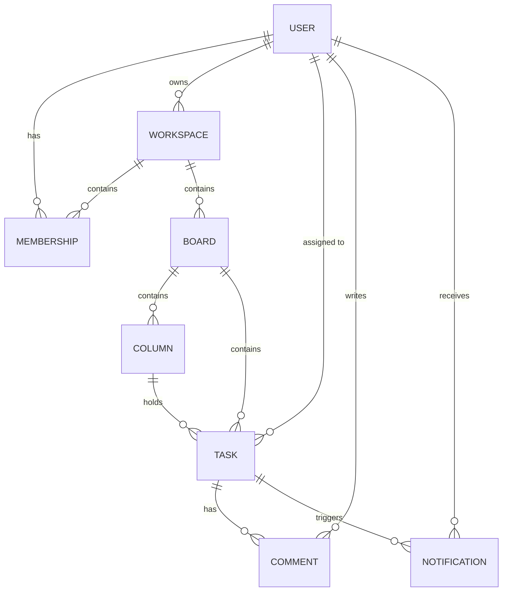

# TaskFlow API


A production-shaped Django REST Framework backend for a real-time task/project management tool: workspaces, boards, columns, tasks and comments — with live WebSocket updates pushed to every connected client and asynchronous email notifications processed off the request/response cycle. Built to demonstrate the two skills e-commerce APIs don't: **Django Channels** (WebSockets) and **Celery** (background jobs), the pair of things clients most often ask for beyond plain CRUD.

**Live demo:** _add your deployed URL here after following the [Deployment](#deployment) section_

## Features

- **JWT authentication** (`djangorestframework-simplejwt`) with a custom, email-based `User` model
- **Workspaces & membership**: role-based access (`owner` / `admin` / `member`), invite-by-email, leave/remove-member flows
- **Boards → Columns → Tasks → Comments**: creating a board auto-provisions "To Do" / "In Progress" / "Done" columns; tasks carry priority, due date, assignee and position for drag-and-drop-style reordering
- **Live WebSocket updates** (`channels` + `daphne`): every task/comment create, update or delete is broadcast in real time to everyone viewing that board, authenticated over the socket via a JWT query parameter
- **Async notifications** (`celery`): assigning a task or commenting sends an email (console backend by default) and creates an in-app `Notification` row, both off the request path
- **Permissions**: workspace-membership-gated reads/writes everywhere, with delete restricted to the task's creator, the comment's author, or a workspace owner/admin (`boards/permissions.py`)
- **Filtering**: tasks filterable by `column`, `assignee` and `priority` (`django-filter`)
- **OpenAPI schema + Swagger UI** via `drf-spectacular`
- **42 automated tests** (`pytest-django` + `factory_boy` + `pytest-asyncio`) covering auth, workspace/board/task permissions, notification side-effects, and the WebSocket connection/broadcast flow with `channels.testing.WebsocketCommunicator`
- **Dockerized**: `web` (daphne, ASGI) + `worker` (Celery) + Postgres + Redis via `docker-compose`, non-root container user, `whitenoise` for static files
- **CI**: GitHub Actions runs migration checks and the full test suite (including the WebSocket tests, with a live Redis service) on every push

## Architecture



Four focused Django apps own the domain (`users`, `workspaces`, `boards`, `notifications`); a fifth, model-free `realtime` app wires up Channels consumers, routing and JWT auth middleware for WebSocket traffic.

## Tech stack

Python · Django · Django REST Framework · Django Channels · Celery · PostgreSQL · Redis · Simple JWT · django-filter · drf-spectacular · Docker · GitHub Actions · pytest

## Quick start (Docker — recommended)

```bash
git clone https://github.com/rufic1337/taskflow-api.git
cd taskflow-api
cp .env.example .env
docker compose up --build
```

This starts `web` (the API, daphne on port 8000), `worker` (Celery), `db` (Postgres) and `redis`. The API is now at `http://localhost:8000/api/`, docs at `http://localhost:8000/api/docs/`.

Seed some demo data (a workspace, a board, tasks, comments, a few users):

```bash
docker compose exec web python manage.py seed_demo_data
# demo login: demo@example.com / demopass123
```

## Quick start (bare metal)

```bash
python -m venv .venv
source .venv/bin/activate   # .venv\Scripts\activate on Windows
pip install -r requirements.txt
cp .env.example .env        # remove/comment DATABASE_URL and REDIS_URL to use SQLite + in-memory channels
python manage.py migrate
python manage.py seed_demo_data
python manage.py runserver
```

Without Redis, `runserver` still works: the WebSocket layer falls back to an in-memory channel layer and Celery tasks can run eagerly (`CELERY_TASK_ALWAYS_EAGER=True`) with no broker or worker process needed — see [Real-time updates](#real-time-updates) below for the trade-off.

## Running tests

```bash
pytest -q
```

## API overview

All endpoints are prefixed with `/api/`. Full interactive docs at `/api/docs/`.

| Method | Endpoint | Description | Auth |
|---|---|---|---|
| POST | `/auth/register/` | Create an account | – |
| POST | `/auth/login/` | Obtain JWT access/refresh tokens | – |
| POST | `/auth/refresh/` | Refresh an access token | – |
| GET/PATCH | `/users/me/` | View/update current user | required |
| GET/POST | `/workspaces/` | List own workspaces / create one (creator becomes owner) | required |
| GET/PATCH/DELETE | `/workspaces/{id}/` | Workspace detail | member (admin/owner to edit) |
| POST | `/workspaces/{id}/invite/` | Invite an existing user by email | admin/owner |
| DELETE | `/workspaces/{id}/members/{user_id}/` | Remove a member | admin/owner |
| POST | `/workspaces/{id}/leave/` | Leave a workspace (owners must transfer first) | member |
| GET/POST | `/boards/?workspace={id}` | List/create boards (creates 3 default columns) | member |
| GET/PATCH/DELETE | `/boards/{id}/` | Board detail | member |
| GET/POST | `/boards/{id}/columns/` | List/add columns on a board | member |
| GET/POST | `/tasks/?board={id}` | List/create tasks; filter by `column`, `assignee`, `priority` | member |
| GET/PATCH/DELETE | `/tasks/{id}/` | Task detail (PATCH `column`/`position` to move it) | member (delete: creator/admin/owner) |
| GET/POST | `/tasks/{id}/comments/` | List/add comments on a task | member |
| GET | `/notifications/` | Current user's notifications, newest first | required |
| POST | `/notifications/{id}/mark_read/` | Mark one notification read | required |
| POST | `/notifications/mark_all_read/` | Mark all notifications read | required |

## Real-time updates

Connect to a board's WebSocket to receive `task.created` / `task.updated` / `task.deleted` / `comment.created` events the instant they happen, authenticated with the same JWT access token used for REST calls:

```js
const ws = new WebSocket(`wss://<host>/ws/boards/1/?token=${accessToken}`);
ws.onmessage = (e) => console.log(JSON.parse(e.data));
// { "event": "task.updated", "data": { "id": 12, "title": "...", "column": 3, ... } }
```

The server rejects the connection (close code `4001`) if no valid token is supplied, and (`4003`) if the token's user isn't a member of that board's workspace.

`CELERY_TASK_ALWAYS_EAGER=True` runs notification tasks synchronously in-process — no broker or worker needed, which is what a single free-tier web dyno without a Celery worker should use. Set it to `False` (with `REDIS_URL` pointing at a real broker and a `worker` process running, as in `docker-compose.yml`) once you want emails/notifications processed off the request path for real.

## Deployment

The image runs `daphne` (ASGI) so both HTTP and WebSocket traffic are served on the same port — on **Render**, a Docker-runtime web service exposes WebSockets over the same HTTPS port automatically (`wss://your-app.onrender.com/ws/...`), no extra configuration needed.

1. Create a PostgreSQL instance and copy its connection string into `DATABASE_URL`.
2. Create a web service from this repo (Docker runtime) and set `SECRET_KEY`, `DEBUG=False`, `ALLOWED_HOSTS`, `DATABASE_URL`.
3. Redis is optional: without `REDIS_URL` the app falls back to an in-memory channel layer and you should set `CELERY_TASK_ALWAYS_EAGER=True` (no worker process needed) — fine for a single-instance demo deployment. If your Render account already has a Postgres instance for another project, a second free Redis/Postgres may not be available; a free Redis add-on or a separate low-cost instance both work if you want the "real" broker path instead.
4. The container runs migrations and `collectstatic` automatically on start (see `entrypoint.sh`).

## License

MIT — see [LICENSE](LICENSE).
